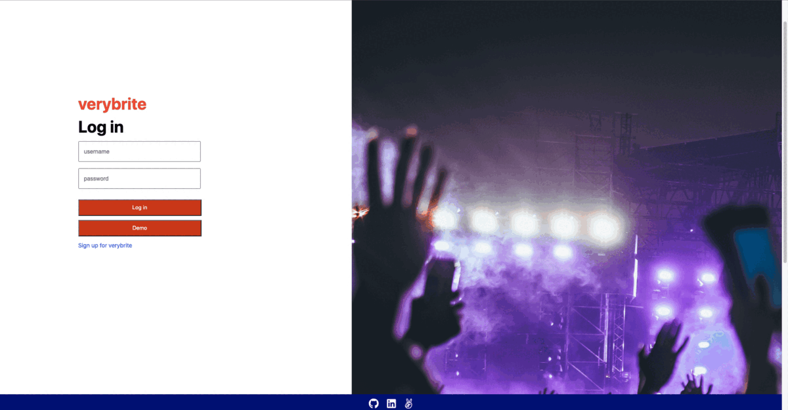
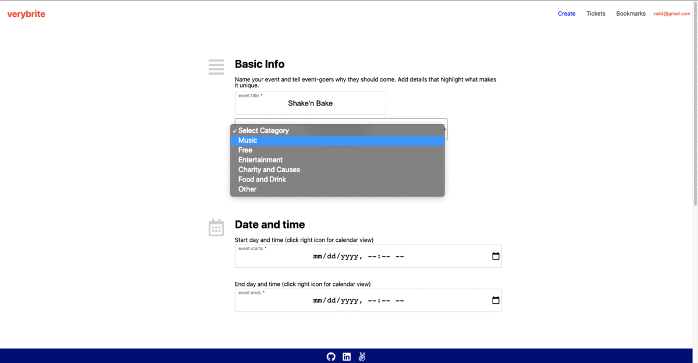

# verybrite

Verybrite is an Eventbrite clone. Users of verybrite are able to search for events with a categories as well as register and/or bookmark those events. Logged-in users also have the ability to create and host their own events.

[Verybrite Live Site](https://very-brite.herokuapp.com/)

## Technologies

Backend:

* Ruby on Rails
* PostgreSQL
* jQuery-rails

Frontend:

* React
* Redux
* CSS/SASS

Hosting: 

* Heroku

## Features

* User authentication

* Full CRUD (**C**reate, **R**ead, **U**pdate and **D**elete) functionality for events

* Registered users can create and delete registrations
* Search events with Categories

* Bookmark and/or Register for Events

## Example Code

A common feature is too display specific errors to users when they try to submit forms. This lets users know 1) that the form did not submit properly and 2) how the users input is invalid. To display errors to the user in real time, Verybrite takes an event-driven approach by checking and verifying user input when an event listener is triggered.

## Future Implementations

* AWS integration
* Search bar
