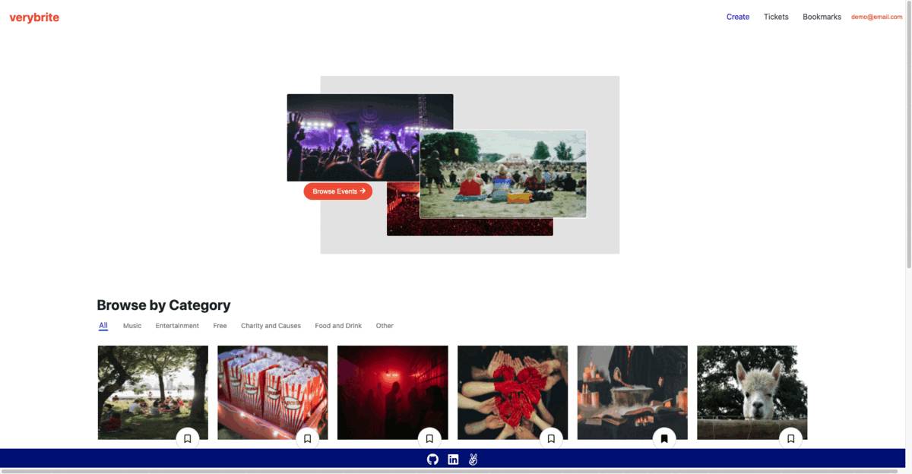
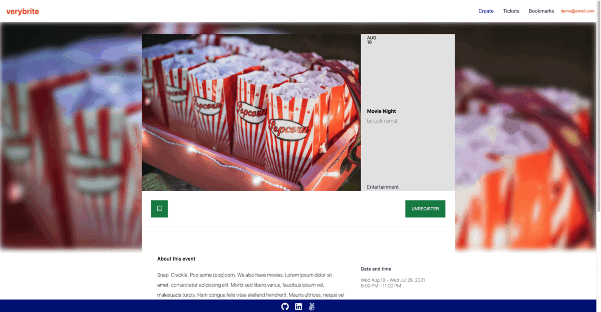

# verybrite

Verybrite is an Eventbrite clone. Users of verybrite can register for the site, create, read and register for events.

[Verybrite Live Site](https://very-brite.herokuapp.com/)

## Technologies

Backend:

* Ruby on Rails
* PostgreSQL
* jQuery-rails

Frontend:

* React
* Redux
* CSS/SASS

Hosting: 

* Heroku

## Features

* User authentication
* Full CRUD (**C**reate, **R**ead, **U**pdate and **D**elete) functionality for events
* Registered users can create and delete registrations

## Example Code

One major technical issue was to auto style added events to the homepage while creating new rows. The solution was, using SASS, I could grab the id's of the elements

#### Search by Event Category

#### Keep Track of Interesting Events with Bookmarks!

## Future Implementations

* AWS integration
* Search bar
